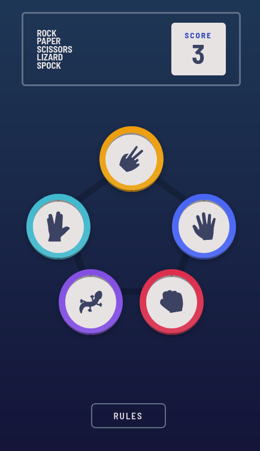

# Frontend Mentor - Rock Paper Scissors Lizard Spock

This is a solution to the Rock Paper Scissors + Bunus(Lizard Spock) from FrontEndMentor

## Table of contents

- [Overview](#overview)
  - [The challenge](#the-challenge)
  - [Screenshot](#screenshot)
  - [Links](#links)
- [My process](#my-process)
  - [Built with](#built-with)
  - [What I learned](#what-i-learned)
- [Author](#author)

## Overview

### The challenge

Users should be able to:

- View the optimal layout for the site depending on their device's screen size
- See hover states for all interactive elements on the page

### Screenshots

 

### Links

- [Solution](https://github.com/RafaelGLeal/RockPaperScissors-Game/)

## My process

### Built with

- Semantic HTML5 markup
- CSS3
- Flexbox
- CSS Grid
- Sass preprocessor
- Javascript

### What I learned

A really good challenge with manipulation of dom and also the logic of the bonus(lizard and spock), i had some dificult with how i could be more efficient with the logic in general, but im happy with the acomplishment but i'll try to improve even more the code later on.